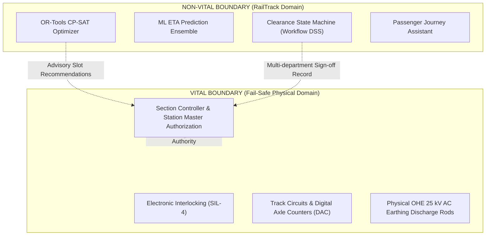

# Railway Safety Boundaries & Non-Vital Architecture

**System**: RailTrack — SIH26028 Railway Block Planner & Passenger Intelligence  
**Document**: Architectural Safety Specification  
**Version**: 3.2.0  

---

## 1. Safety Classification & Legal Disclaimer

> [!CAUTION]
> **LEGAL NOTICE: NON-VITAL ADVISORY DECISION SUPPORT SYSTEM**  
> RailTrack is classified as an **Advisory Decision Support System (ADSS)** under Indian Railways operational guidelines. It is strictly **NON-VITAL** and has not been certified to CENELEC EN 50126, EN 50128, or EN 50129 Safety Integrity Levels (SIL-1 through SIL-4).
>
> All recommendations, predicted schedules, and proposed maintenance slots generated by RailTrack are **advisory only**. They do not constitute authority to occupy track, disconnect signaling, or de-energize overhead equipment without human controller authorization and physical on-ground safety verification.

---

## 2. Separation of Vital vs Non-Vital Functions

1. **Vital Functions (Outside RailTrack)**:
   - Setting points, locking routes, and clearing signal aspects.
   - Proving track clearance via track circuits and axle counters.
   - Physical earthing and de-energization of the 25 kV AC catenary.
   - Authorizing train movement into an occupied or isolated section.
2. **Non-Vital Functions (Inside RailTrack)**:
   - Computing mathematical possession windows to minimize regulation delays.
   - Calculating run-time dilation ($\Delta t$) resulting from Temporary Speed Restrictions (TSR).
   - Tracking departmental review checklists (Operations, P-Way, OHE).
   - Providing passengers with journey connection buffer recommendations.

---

## 3. Four Safety Gates Enforced by RailTrack

### Gate 1: Sequential Departmental Review Chain
Clearance cannot jump directly from creation to approval. It must traverse:
$$\text{DRAFT} \to \text{AI\_RECOMMENDED} \to \text{OPERATIONS\_REVIEW} \to \text{ENGINEERING\_REVIEW} \to \text{TRACTION\_OHE\_REVIEW} \to \text{AUTHORIZED} \to \text{APPROVED}$$

### Gate 2: Separation of Duties
The user who created the maintenance block proposal cannot grant the final `APPROVED` authorization. A distinct, authorized Section Controller or Divisional Officer must review and approve.

### Gate 3: Traction Power (25 kV AC OHE) Isolation
Clearance approval and TMS commit strictly require an active Permit-to-Work (`PERMIT_ACTIVE`):
- Permit must match the corridor section.
- Permit must be verified with an authoritative TPC permit number.
- Expired or revoked permits immediately abort approval and commit.

### Gate 4: Independent Schedule Constraint Validation
Before any schedule returned by the CP-SAT optimizer is accepted, an autonomous validator (`validate_schedule_independently`) independently verifies zero resource overlaps and headway compliance without reusing the solver's code.

---

## 4. Emergency Revocation & Invalidation

Section Controllers and Chief Controllers retain authority to immediately revoke track possession:
- Endpoint: `POST /api/clearance/{block_id}/invalidate`
- Marks clearance as `INVALIDATED`, auto-revokes OHE permits, and alerts operational consoles.
